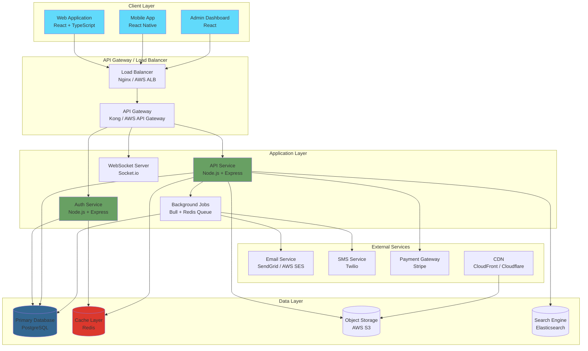
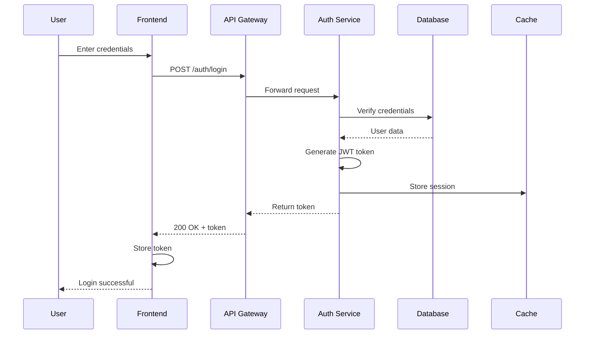
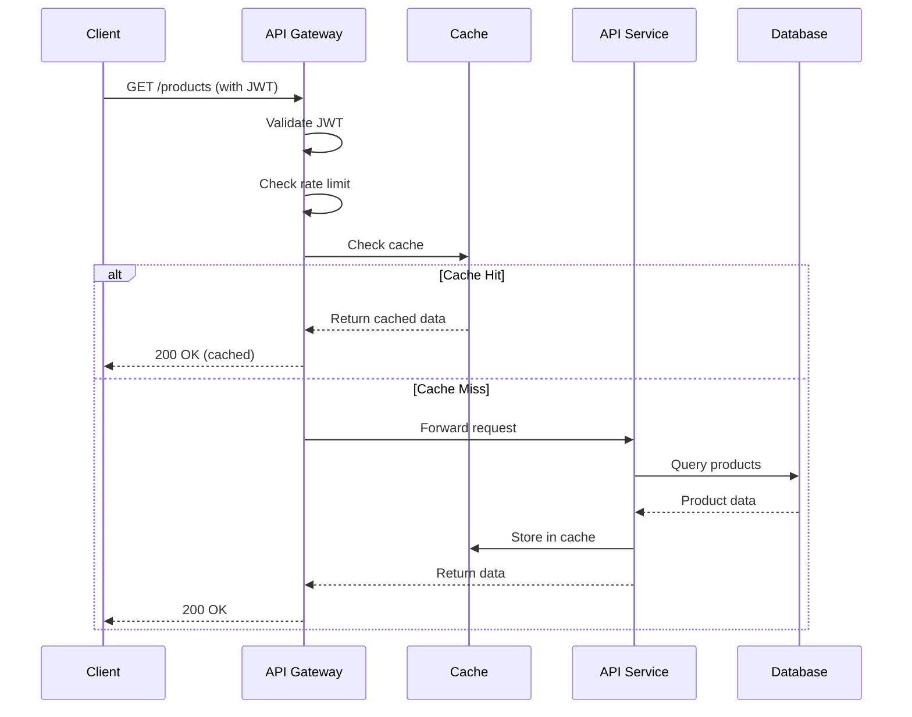
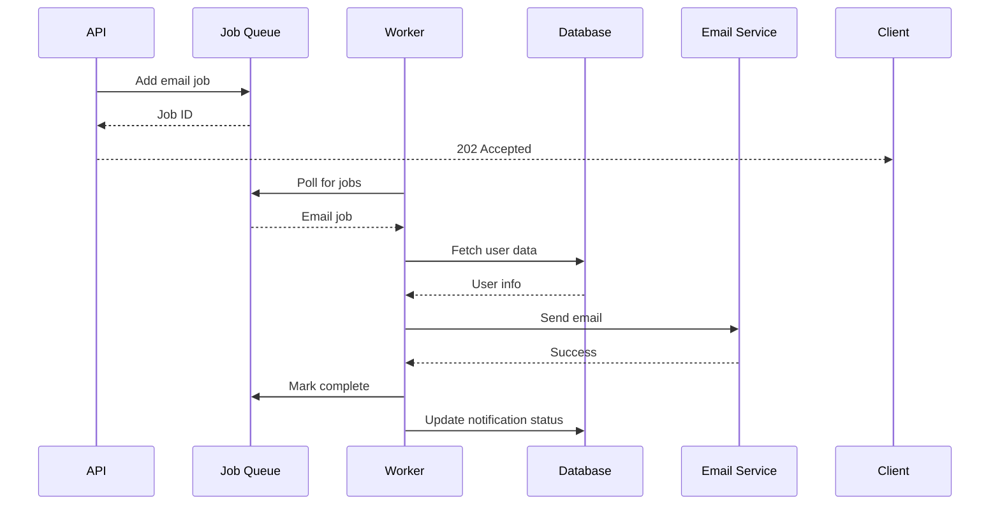
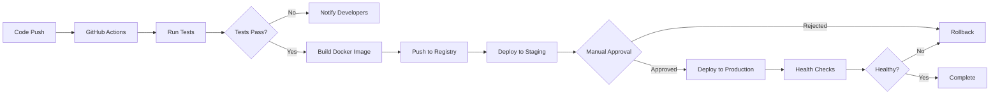

## Overview

Our application follows a modern **microservices-inspired architecture** with clear separation of concerns, emphasizing scalability, maintainability, and developer productivity.

### Architecture Principles

- **Separation of Concerns**: Each layer has a distinct responsibility
- **Scalability**: Horizontal scaling capabilities at each layer
- **Resilience**: Fault-tolerant design with graceful degradation
- **Security**: Defense in depth with multiple security layers
- **Observability**: Comprehensive logging, monitoring, and tracing

---

## High-Level Architecture


<figure>  <figcaption> Achitecture Diagram.</figcaption> </figure>

---

## Layer-by-Layer Breakdown

### 1. Client Layer

#### Web Application (React SPA)
- **Technology**: React 18, TypeScript, Vite
- **State Management**: Redux Toolkit / Zustand
- **Styling**: Tailwind CSS + shadcn/ui
- **Features**:
  - Server-Side Rendering (SSR) ready with Next.js (optional)
  - Progressive Web App (PWA) capabilities
  - Responsive design for all screen sizes
  - Real-time updates via WebSocket

#### Mobile Application (Optional)
- **Technology**: React Native / Flutter
- **Features**:
  - Native performance
  - Offline-first architecture
  - Push notifications
  - Biometric authentication

#### Admin Dashboard
- **Technology**: React + TypeScript
- **Features**:
  - Advanced analytics and reporting
  - User management
  - Content moderation
  - System monitoring

**Communication**: RESTful API + WebSocket for real-time features

---

### 2. API Gateway / Load Balancer

#### Load Balancer
- **Purpose**: Distribute traffic across multiple API instances
- **Technology**: Nginx / AWS Application Load Balancer
- **Features**:
  - SSL/TLS termination
  - Health checks
  - Auto-scaling integration
  - DDoS protection

#### API Gateway
- **Purpose**: Single entry point for all client requests
- **Technology**: Kong / AWS API Gateway / Custom Express middleware
- **Responsibilities**:
  - Request routing
  - Rate limiting (1000 req/min per user)
  - API versioning
  - Request/response transformation
  - CORS handling
  - Request logging

---

### 3. Application Layer

#### Authentication Service
**Responsibilities**:
- User registration and login
- JWT token generation and validation
- OAuth2 integration (Google, GitHub, etc.)
- Password reset and email verification
- Session management

**Technology Stack**:
```
Node.js + Express + TypeScript
Passport.js for OAuth
bcrypt for password hashing
jsonwebtoken for JWT
```

**Key Endpoints**:
- `POST /auth/register` - User registration
- `POST /auth/login` - User login
- `POST /auth/refresh` - Token refresh
- `POST /auth/logout` - User logout
- `POST /auth/forgot-password` - Password reset

---

#### Main API Service
**Responsibilities**:
- Core business logic
- CRUD operations
- Data validation
- Business rule enforcement
- Integration with external services

**Architecture Pattern**: Layered Architecture
```
Controllers (HTTP Layer)
    ↓
Services (Business Logic)
    ↓
Repositories (Data Access)
    ↓
Models/Entities (Database)
```

**Key Modules**:
- **User Module**: User profile management
- **Product Module**: Product catalog operations
- **Order Module**: Order processing and fulfillment
- **Payment Module**: Payment processing integration
- **Notification Module**: Email/SMS/Push notifications

---

#### Background Jobs Service
**Purpose**: Handle asynchronous, long-running tasks
**Technology**: Bull (Redis-backed job queue)

**Job Types**:
- Email sending (welcome emails, notifications)
- Data processing and aggregation
- Report generation
- Image/video processing
- Database cleanup tasks
- Third-party API synchronization

**Queue Configuration**:
```javascript
High Priority Queue (Priority: 1)
- Payment processing
- Critical notifications

Normal Queue (Priority: 5)
- User emails
- Data exports

Low Priority Queue (Priority: 10)
- Analytics processing
- Cleanup tasks
```

---

#### WebSocket Server
**Purpose**: Real-time bidirectional communication
**Technology**: Socket.io / native WebSocket

**Use Cases**:
- Live notifications
- Real-time chat/messaging
- Live updates (dashboards, feeds)
- Collaborative features
- Presence detection (online/offline status)

**Connection Flow**:
```
1. Client connects with JWT token
2. Server validates token
3. Connection established
4. Subscribe to relevant channels
5. Receive real-time updates
```

---

### 4. Data Layer

#### Primary Database (PostgreSQL)
**Purpose**: Main transactional data store

**Schema Design**:
```
Users Table
├── id (UUID, Primary Key)
├── email (Unique)
├── password_hash
├── name
├── role
├── created_at
└── updated_at

Products Table
├── id (UUID, Primary Key)
├── name
├── description
├── price
├── stock
├── category_id (Foreign Key)
└── created_at

Orders Table
├── id (UUID, Primary Key)
├── user_id (Foreign Key)
├── total_amount
├── status
├── created_at
└── updated_at

Order_Items Table
├── id (UUID, Primary Key)
├── order_id (Foreign Key)
├── product_id (Foreign Key)
├── quantity
└── price
```

**Database Features**:
- **Indexing**: Optimized indexes on frequently queried columns
- **Partitioning**: Time-based partitioning for large tables
- **Replication**: Read replicas for scalability
- **Backup**: Automated daily backups with 30-day retention
- **Migrations**: Version-controlled schema migrations (Prisma/TypeORM)

---

#### Cache Layer (Redis)
**Purpose**: Improve performance and reduce database load

**Use Cases**:
1. **Session Storage**
   - User sessions
   - JWT token blacklist

2. **Data Caching**
   ```
   Cache Strategy: Cache-Aside Pattern
   TTL: 5 minutes for volatile data, 1 hour for stable data
   ```
   - User profiles
   - Product catalog
   - Configuration data

3. **Rate Limiting**
   - API rate limits per user/IP
   - Brute force protection

4. **Job Queue**
   - Background job management
   - Task scheduling

**Cache Invalidation**:
- Event-based invalidation on data updates
- TTL-based expiration
- Manual purge via admin dashboard

---

#### Object Storage (AWS S3 / MinIO)
**Purpose**: Store user-generated content and static assets

**Storage Structure**:
```
s3://bucket-name/
├── uploads/
│   ├── avatars/
│   ├── documents/
│   └── images/
├── exports/
│   └── reports/
└── backups/
    └── database/
```

**Features**:
- Pre-signed URLs for secure uploads
- CDN integration for fast delivery
- Lifecycle policies for cost optimization
- Versioning enabled for critical files

---

#### Search Engine (Elasticsearch - Optional)
**Purpose**: Full-text search and analytics

**Indexed Data**:
- Products (name, description, tags)
- Users (name, email)
- Content (articles, posts)

**Features**:
- Fuzzy search
- Auto-complete suggestions
- Faceted search
- Aggregations and analytics

---

### 5. External Services Integration

#### Email Service
- **Provider**: SendGrid / AWS SES / Mailgun
- **Use Cases**: Transactional emails, marketing campaigns
- **Templates**: Welcome, password reset, order confirmation

#### SMS Service
- **Provider**: Twilio / AWS SNS
- **Use Cases**: OTP verification, alerts

#### Payment Gateway
- **Provider**: Stripe / PayPal / Razorpay
- **Features**: 
  - Card payments
  - Webhook handling for payment events
  - Subscription management
  - Refund processing

#### CDN (Content Delivery Network)
- **Provider**: CloudFront / Cloudflare
- **Purpose**: Serve static assets with low latency globally

---

## Data Flow Diagrams

### 1. User Authentication Flow



### 2. API Request Flow (Authenticated)



### 3. Background Job Processing



---

## Design Patterns

### 1. Repository Pattern
**Purpose**: Abstract data access logic

```typescript
// repositories/UserRepository.ts
export class UserRepository {
  async findById(id: string): Promise<User | null> {
    return await db.user.findUnique({ where: { id } });
  }

  async create(data: CreateUserDto): Promise<User> {
    return await db.user.create({ data });
  }

  async update(id: string, data: UpdateUserDto): Promise<User> {
    return await db.user.update({ where: { id }, data });
  }
}
```

### 2. Service Layer Pattern
**Purpose**: Encapsulate business logic

```typescript
// services/UserService.ts
export class UserService {
  constructor(
    private userRepository: UserRepository,
    private emailService: EmailService
  ) {}

  async createUser(data: CreateUserDto): Promise<User> {
    // Business logic
    const user = await this.userRepository.create(data);
    await this.emailService.sendWelcomeEmail(user.email);
    return user;
  }
}
```

### 3. Dependency Injection
**Purpose**: Loose coupling and testability

```typescript
// Dependency injection container
container.bind(UserRepository).toSelf();
container.bind(UserService).toSelf();
container.bind(EmailService).toSelf();
```

### 4. Circuit Breaker Pattern
**Purpose**: Prevent cascading failures in external service calls

```typescript
const circuitBreaker = new CircuitBreaker(externalService.call, {
  timeout: 3000,
  errorThreshold: 50,
  resetTimeout: 30000
});
```

---

## Security Architecture

### 1. Authentication & Authorization
- **JWT Tokens**: Short-lived access tokens (15 min), long-lived refresh tokens (7 days)
- **RBAC**: Role-Based Access Control (User, Admin, Moderator)
- **OAuth2**: Third-party authentication support

### 2. API Security
- **HTTPS Only**: All traffic encrypted with TLS 1.3
- **Rate Limiting**: Prevent abuse (1000 requests/hour per user)
- **Input Validation**: Request validation with Zod/Joi
- **SQL Injection Prevention**: Parameterized queries via ORM
- **XSS Prevention**: Output sanitization
- **CSRF Protection**: CSRF tokens for state-changing operations

### 3. Data Security
- **Encryption at Rest**: Database encryption
- **Encryption in Transit**: TLS for all connections
- **Password Hashing**: bcrypt with salt rounds = 12
- **PII Protection**: Sensitive data encryption

### 4. Infrastructure Security
- **VPC**: Isolated network for backend services
- **Security Groups**: Strict firewall rules
- **Secrets Management**: AWS Secrets Manager / HashiCorp Vault
- **DDoS Protection**: CloudFlare / AWS Shield

---

## Scalability Strategy

### Horizontal Scaling
- **API Servers**: Auto-scaling based on CPU/memory usage
- **Database**: Read replicas for read-heavy operations
- **Cache**: Redis Cluster for distributed caching
- **Job Workers**: Scale workers based on queue length

### Vertical Scaling
- Increase instance sizes during peak times
- Database connection pooling

### Database Optimization
- **Indexing**: Optimize query performance
- **Query Optimization**: Analyze and optimize slow queries
- **Caching**: Cache frequently accessed data
- **Connection Pooling**: Reuse database connections

---

## Monitoring & Observability

### Application Monitoring
- **APM**: Datadog / New Relic
  - Request latency tracking
  - Error rate monitoring
  - Database query performance

### Logging
- **Centralized Logging**: ELK Stack / CloudWatch
- **Log Levels**: ERROR, WARN, INFO, DEBUG
- **Structured Logging**: JSON format for easy parsing

### Metrics
- **System Metrics**: CPU, Memory, Disk, Network
- **Application Metrics**: Request rate, error rate, response time
- **Business Metrics**: User signups, orders, revenue

### Alerting
- **Critical Alerts**: 
  - API downtime
  - Database connection failures
  - High error rates (>5%)
- **Warning Alerts**:
  - High response time (>1s)
  - High memory usage (>80%)
  - Failed background jobs

---

## Disaster Recovery & High Availability

### Backup Strategy
- **Database**: Automated daily backups, 30-day retention
- **Files**: S3 versioning and cross-region replication
- **Configuration**: Version-controlled in Git

### High Availability
- **Multi-AZ Deployment**: Services across multiple availability zones
- **Load Balancing**: Distribute traffic across healthy instances
- **Health Checks**: Automated health monitoring
- **Failover**: Automatic failover to healthy instances

### Recovery Objectives
- **RTO** (Recovery Time Objective): 1 hour
- **RPO** (Recovery Point Objective): 15 minutes

---

## Deployment Architecture

### Environment Strategy
```
Development → Staging → Production
```

**Development**:
- Local development with Docker Compose
- Hot reload enabled
- Debug logging

**Staging**:
- Mirrors production environment
- Used for QA and testing
- Deployed on every PR merge

**Production**:
- Multi-region deployment (optional)
- Blue-green deployment strategy
- Canary releases for gradual rollout

### CI/CD Pipeline



---

## Technology Stack Summary

| Layer | Technology | Purpose |
|-------|-----------|---------|
| Frontend | React + TypeScript | User interface |
| API Gateway | Nginx / Kong | Request routing |
| Backend | Node.js + Express | Business logic |
| Database | PostgreSQL | Data persistence |
| Cache | Redis | Performance |
| Queue | Bull + Redis | Background jobs |
| Storage | AWS S3 | File storage |
| Monitoring | Datadog | Observability |
| Deployment | Docker + K8s | Containerization |

---

## Future Enhancements

### Short Term (3-6 months)
- [ ] Implement GraphQL API alongside REST
- [ ] Add Elasticsearch for advanced search
- [ ] Set up automated performance testing
- [ ] Implement feature flags

### Medium Term (6-12 months)
- [ ] Migrate to microservices architecture
- [ ] Add event-driven architecture with Kafka
- [ ] Implement distributed tracing
- [ ] Multi-region deployment

### Long Term (12+ months)
- [ ] Machine learning integration
- [ ] Serverless functions for specific workloads
- [ ] Edge computing capabilities
- [ ] Real-time analytics dashboard

---

## Key Takeaways

✅ **Modular Architecture**: Easy to understand and maintain
✅ **Scalable Design**: Horizontal and vertical scaling capabilities
✅ **Secure by Default**: Multiple layers of security
✅ **Observable**: Comprehensive monitoring and logging
✅ **Resilient**: Fault-tolerant with graceful degradation
✅ **Developer Friendly**: Clear patterns and best practices

---

## Additional Resources

- [API Documentation](/api)
- [Frontend Architecture](/frontend)
- [Backend Architecture](/backend)
- [Database Schema](/backend/database)
- [Deployment Guide](/guides/deployment)
- [Security Best Practices](/internal/security)