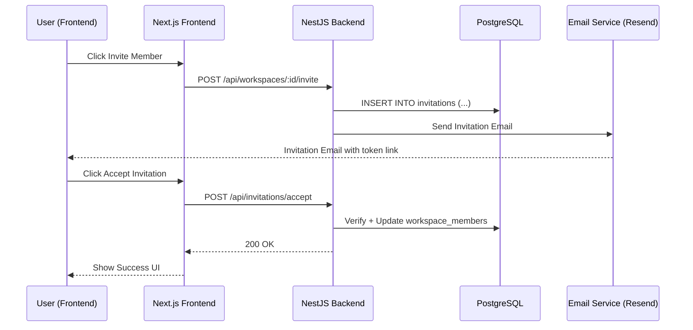

## Login

### 🏷️ Overview

**Feature Name:** User Login Flow
**Module/Scope:** Authentication
**Author:** Nikhil Harmalkar
**Last Updated:** `2025-11-02`
**Status:** `Completed`

**Short Summary:**

Login via Clerk

- Frontend: Integrate Clerk React SDK and render Clerk's `<SignIn/>` (or useSignIn/useUser hooks) inside ClerkProvider (CLERK_FRONTEND_API). After successful sign-in Clerk manages the session and exposes the authenticated user via useUser.

- Backend: Protect APIs by verifying Clerk sessions with @clerk/nextjs or @clerk/clerk-sdk-node (requireAuth / withAuth / verifyToken). Use clerkUserId from the verified session to upsert a local user record on first login.

- Environment: CLERK_FRONTEND_API, CLERK_SECRET_KEY.

- Notes: Rely on Clerk for authentication, session lifecycle, and provider/OAuth handling; backend should only accept requests with a verified Clerk session.

---

### 🎯 Feature Goals & Requirements

**Business Goals**

- Clear description of the user/business value this feature provides.

**Technical Goals**

- Define what this feature achieves technically.
- Example: “Syncs invitation acceptance with Clerk user creation flow.”

**Non-Goals**

- (Optional) Clarify what the feature doesn’t handle (to avoid confusion later).

---

### ⚙️ High-Level Flow

> Quick bullet sequence of how the feature works from frontend → backend → database.

```
Frontend → API → Backend Service → Database → Response → UI Update
```

**Example**

1. User clicks "Invite Member" → triggers modal with email & role input.
2. Frontend calls `/api/workspaces/:id/invite` via Axios.
3. Backend validates request → creates invitation record → sends email via Resend.
4. Invitee clicks email link → frontend calls `/api/invitations/accept`.
5. Backend validates token → adds member to workspace → deletes invitation record.
6. Frontend redirects to workspace dashboard with success banner.

---

### 🧠 Architecture Flow Diagram (Sequence)

Use PlantUML / Mermaid / or Zudoku’s built-in diagram block:



---

### 💻 Frontend Implementation

**Location:**
`/src/features/workspaces/invite/InviteModal.tsx`
`/src/api/invite.api.ts`

**Key Hooks / Components**

- `useInviteMemberMutation`
- `InviteMemberForm`
- `ModalProvider`

**Key Libraries**

- `react-hook-form`, `zod`, `axios`, `tanstack-query`

**Flow**

1. Form validation using Zod schema
2. Call `POST /api/workspaces/:id/invite` mutation
3. On success → show toast & invalidate query `workspaceMembers`

**Example Pseudo:**

```tsx
const mutation = useMutation({
  mutationFn: inviteMemberApi,
  onSuccess: () => queryClient.invalidateQueries(workspaceKeys.members()),
});
```

---

### 🧰 Backend Implementation

**Location:**
`/src/modules/invitations/invitations.controller.ts`
`/src/modules/invitations/invitations.service.ts`

**Key Endpoints**

- `POST /api/workspaces/:id/invite` → `createInvitation()`
- `POST /api/invitations/accept` → `acceptInvitation()`

**Key Functions**

- `generateInvitationToken()`
- `validateInvitationToken()`
- `addMemberToWorkspace()`

**Middleware**

- `authenticateUser`
- `attachWorkspaceContext`

**Logic Summary**

- Validate permissions → only admins can invite
- Store invitation in `workspace_invitations`
- Use Resend API for email
- On acceptance, validate token & add to `workspace_members`

---

### 🧾 Database Schema (Drizzle / Prisma)

```sql
CREATE TABLE workspace_invitations (
  id UUID PRIMARY KEY DEFAULT gen_random_uuid(),
  workspace_id UUID NOT NULL REFERENCES workspaces(id),
  email VARCHAR(255) NOT NULL,
  role VARCHAR(50) NOT NULL,
  token VARCHAR(255) UNIQUE NOT NULL,
  expires_at TIMESTAMP NOT NULL,
  created_at TIMESTAMP DEFAULT NOW(),
  updated_at TIMESTAMP DEFAULT NOW()
);
```

**Relations**

- `workspace_invitations.workspace_id → workspaces.id`
- After acceptance → `workspace_members.user_id → users.id`

---

### 🧪 Testing Notes

**Manual Testing**

- Test invite email received
- Expired token case
- Re-inviting an existing member

**Postman Collection:**
`/docs/postman/workspace-invitations.postman.json`

**Automated Tests**

- `invitations.service.spec.ts`
- `invitations.controller.spec.ts`

---

### 📡 CI/CD & Deployment Notes

- Feature flag (if any)
- Environment variables used:

  ```
  RESEND_API_KEY=
  INVITE_TOKEN_SECRET=
  INVITE_TOKEN_EXPIRY=24h
  ```

- Migration path:

  - Run `pnpm drizzle:push` before deploying backend.

---

### 🧭 Future Enhancements

- Add bulk invitations
- Add analytics for pending invites
- Add retry email for failed deliveries

---

### 📚 References

- [Clerk Docs – Organizations](https://clerk.com/docs/organizations)
- [Resend API – Send Email](https://resend.com/docs/api-reference/emails/send)
- Internal Slack Thread: `#workspace-invitation-flow`

---

## ✅ Template Reusability Guide

When documenting new features, **duplicate this file** and just modify:

- Overview section (feature name, summary)
- Frontend, Backend, DB details
- Mermaid diagram
- CI/CD variables
- Future roadmap

---

Would you like me to format this into a **ready-to-use Zudoku `.mdx` documentation page structure** (with Tailwind classes, sections, and Zudoku syntax for collapsibles and diagrams)?
That way, you can copy–paste it directly into your `/docs/features/` folder.
